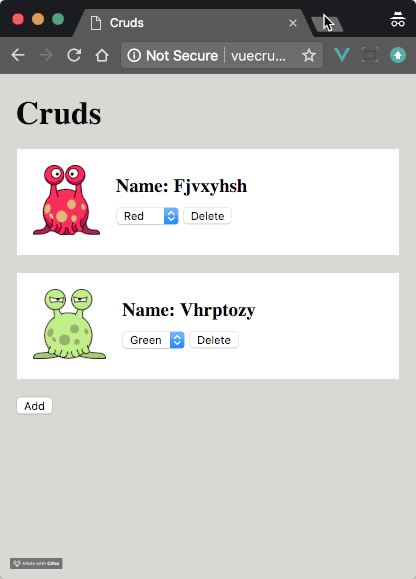

# vue-laravel-crud

Vue 2.5 + Laravel 5.5 + Axios CRUD example app

> Inspiration from [https://github.com/herusdianto/laravel-vue-crud](https://github.com/herusdianto/laravel-vue-crud)



### Installation

1. Clone repo

2. Change to directory

````
cd vue-laravel-crud
````   

3. Install dependencies

````
composer install
````

4. Copy .env file

```
cp .env.example .env
```

5. Modify `DB_*` value in `.env` with your database config.

6. Generate application key:

````
php artisan key:generate
````

7. Migrate
````
php artisan migrate
````

8. Install Node modules
````
npm install
````

9. Build

````
npm run prod
````

### Dummy Data

1. Open Tinker

````
php artisan tinker
````
    
2. Use factory script
````
factory(App\Crud::class, 3)->create();
````
